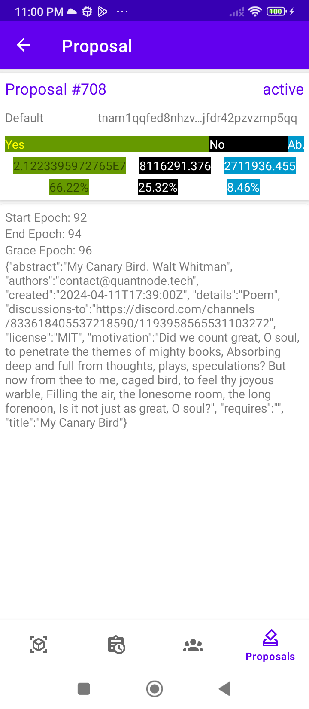

# Download APK to install:
[https://github.com/tommydo113/namada-app/blob/main/app/release/app-release.apk]
# Namada SE App

 This app provides a user-friendly interface to interact with the Namada.net blockchain, offering a range of features to enhance your experience.

## Features

•  [**Block and Network Information**]: Get real-time insights into blocks and network statistics, search block by height.

•  [**Transaction History**]: View detailed lists of transactions, search transaction by hash.

•  [**Validator List**]: Explore and search for validators by address or moniker.

•  [**Governance**]: Participate in governance by viewing and filtering proposals by kind, status.

## Demo Video:

## Screenshots

## Installation

To install the Namada.net Explorer app, follow these steps:

1. Clone the repository:

git clone https://github.com/tommydo113/namada-app.git

2. Open the project in Android Studio.
3. Build and run the application on your device or emulator.

## Usage

After launching the app, navigate through the tabs to access different features. You can view the latest blocks, search for specific transactions, and explore validator profiles. To participate in governance, visit the Governance tab.

## Contributing

Contributions are what make the open-source community such an amazing place to learn, inspire, and create. Any contributions you make are [**greatly appreciated**].

1. Fork the project.
2. Create your feature branch (`git checkout -b feature/AmazingFeature`).
3. Commit your changes (`git commit -m 'Add some AmazingFeature'`).
4. Push to the branch (`git push origin feature/AmazingFeature`).
5. Open a pull request.

## Thank you: This app is consuming API from https://namada.api.explorers.guru/ and [https://it.api.namada.red/](https://api.namada.valopers.com/)

TommyApps - tommy.do.mobile@gmail.com

Project Link: [https://github.com/tommydo113/namada-app](https://github.com/tommydo113/namada-app)
